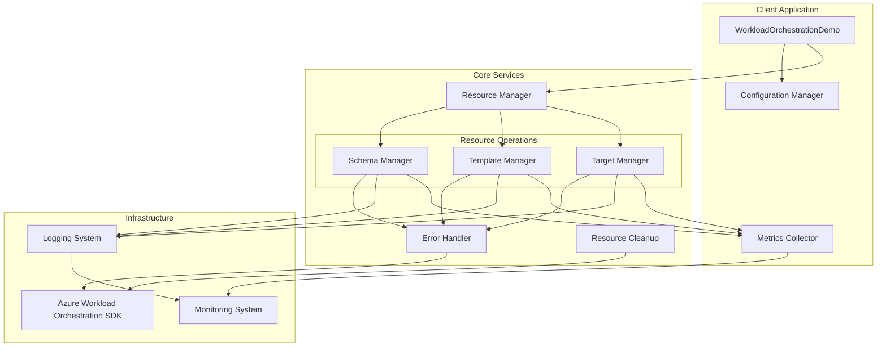
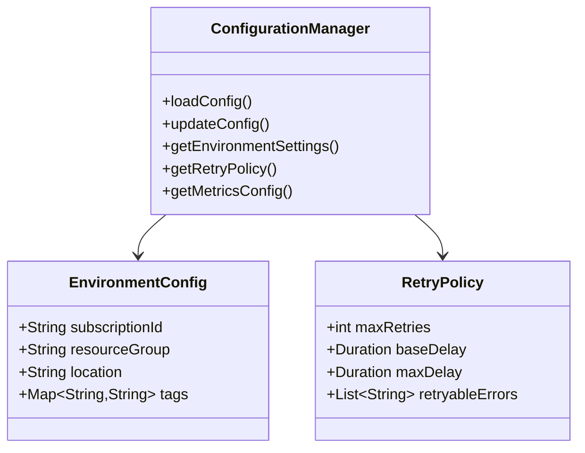
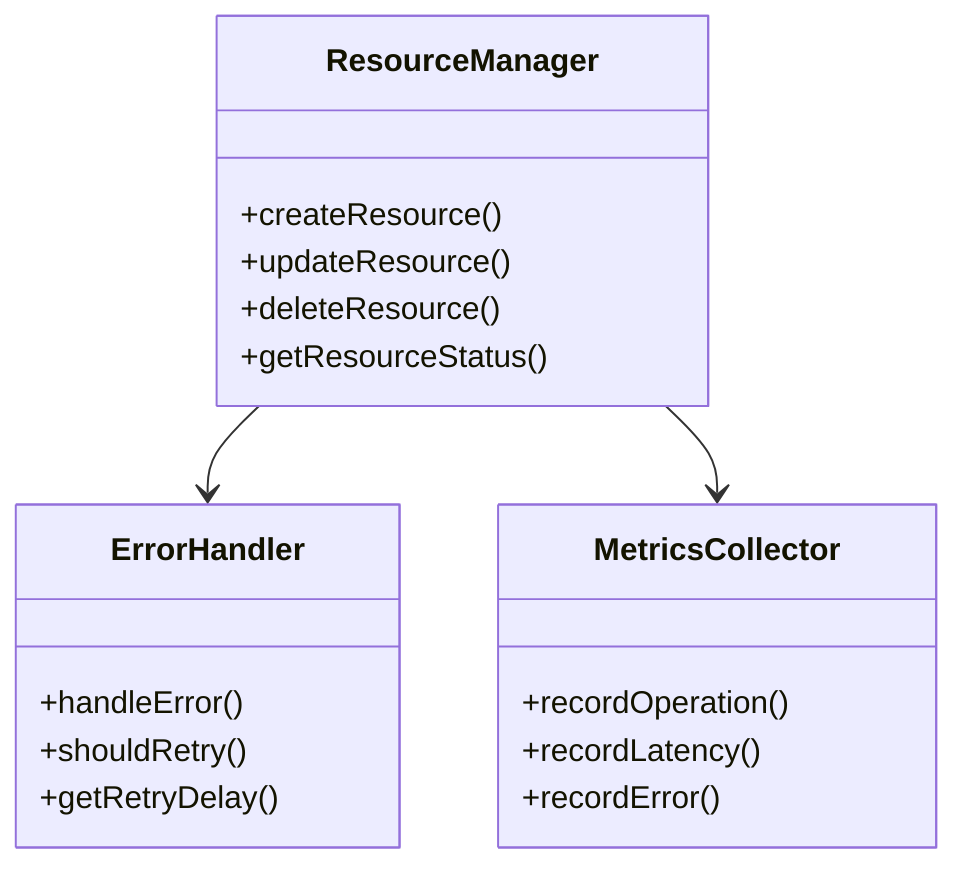

# Azure Workload Orchestration Implementation Architecture

## System Architecture

## Key Improvements

1. **Configuration Management**
   - Externalized configuration for environment-specific settings
   - Dynamic configuration updates without redeployment
   - Secure credential management

2. **Error Handling & Retry Strategy**
   - Circuit breaker pattern for failing operations
   - Exponential backoff retry mechanism
   - Operation-specific retry policies
   - Detailed error tracking and reporting

3. **Resource Management**
   - Fluent interface for resource operations
   - Automatic resource cleanup
   - Resource state tracking
   - Dependency management between resources

4. **Monitoring & Metrics**
   - Operation latency tracking
   - Success/failure rates
   - Resource usage metrics
   - Custom business metrics

5. **Testing Strategy**
   - Unit tests for business logic
   - Integration tests for Azure SDK interactions
   - E2E tests for complete workflows
   - Performance testing scenarios

## Component Details

### Configuration Manager

### Resource Manager

## Implementation Plan

1. **Phase 1: Foundation**
   - Update SDK dependencies
   - Implement configuration management
   - Set up basic monitoring

2. **Phase 2: Core Improvements**
   - Enhance error handling
   - Implement retry mechanisms
   - Add resource cleanup

3. **Phase 3: Monitoring & Metrics**
   - Add detailed metrics collection
   - Implement monitoring dashboards
   - Set up alerts

4. **Phase 4: Testing & Validation**
   - Implement comprehensive test suite
   - Perform load testing
   - Document API changes