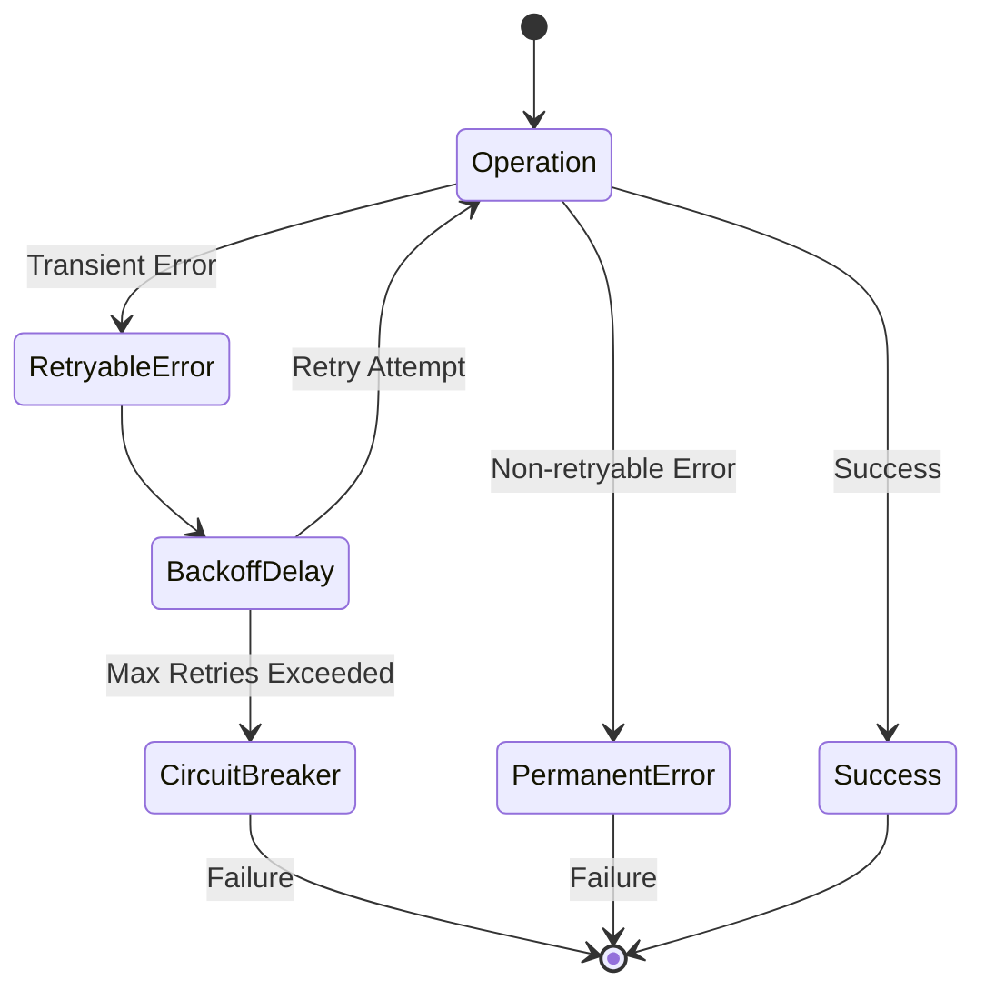

# Error Handling and Retry Strategy

## Error Classification

### 1. Transient Errors
- Network connectivity issues
- Azure throttling responses
- Temporary service unavailability
- Resource contentions
- Timeout errors

### 2. Permanent Errors
- Authentication failures
- Resource not found
- Invalid request format
- Permission issues
- Resource quota exceeded

### 3. Business Logic Errors
- Invalid state transitions
- Dependency conflicts
- Resource validation failures
- Schema validation errors

## Retry Strategy



### Retry Policy Configuration
```java
public class RetryConfig {
    private final int maxRetries;
    private final Duration initialDelay;
    private final Duration maxDelay;
    private final double backoffMultiplier;
    private final Set<String> retryableExceptions;
    private final Map<String, RetryableOperation> operationPolicies;
}

public class RetryableOperation {
    private final String operationType;
    private final int maxAttempts;
    private final Duration timeout;
    private final boolean requiresCleanup;
}
```

### Implementation Strategy

1. **Base Retry Handler**
```java
public class RetryHandler {
    public <T> T executeWithRetry(
        Supplier<T> operation,
        RetryConfig config,
        String operationType
    ) {
        int attempts = 0;
        Duration delay = config.getInitialDelay();

        while (attempts < config.getMaxRetries()) {
            try {
                return operation.get();
            } catch (Exception e) {
                handleException(e, attempts, config, operationType);
                delay = calculateNextDelay(delay, config);
                attempts++;
            }
        }
        throw new MaxRetriesExceededException(operationType);
    }

    private void handleException(
        Exception e, 
        int attempt, 
        RetryConfig config,
        String operationType
    ) {
        if (!isRetryable(e, config)) {
            throw new NonRetryableException(e);
        }
        logRetryAttempt(e, attempt, operationType);
        applyBackoffDelay(calculateDelay(attempt, config));
    }
}
```

2. **Circuit Breaker Integration**
```java
public class CircuitBreaker {
    private final String operationType;
    private final int failureThreshold;
    private final Duration resetTimeout;
    private State state;
    private int failureCount;
    private Instant lastFailure;

    public enum State {
        CLOSED, OPEN, HALF_OPEN
    }

    public <T> T executeWithCircuitBreaker(Supplier<T> operation) {
        checkState();
        try {
            T result = operation.get();
            reset();
            return result;
        } catch (Exception e) {
            handleFailure(e);
            throw e;
        }
    }
}
```

3. **Resource Operation Wrapper**
```java
public class ResourceOperation<T> {
    private final RetryHandler retryHandler;
    private final CircuitBreaker circuitBreaker;
    private final MetricsCollector metricsCollector;

    public T execute(
        Supplier<T> operation,
        String operationType,
        RetryConfig config
    ) {
        return metricsCollector.record(operationType, () ->
            circuitBreaker.executeWithCircuitBreaker(() ->
                retryHandler.executeWithRetry(
                    operation,
                    config,
                    operationType
                )
            )
        );
    }
}
```

## Error Recovery Mechanisms

### 1. Operation Rollback
- Maintain operation state
- Implement compensating transactions
- Clean up partial resources
- Log rollback actions

### 2. Resource Cleanup
```java
public class ResourceCleanup {
    private final Queue<CleanupAction> cleanupQueue;
    
    public void registerCleanupAction(CleanupAction action) {
        cleanupQueue.add(action);
    }
    
    public void executeCleanup() {
        while (!cleanupQueue.isEmpty()) {
            CleanupAction action = cleanupQueue.poll();
            try {
                action.execute();
            } catch (Exception e) {
                logCleanupFailure(action, e);
            }
        }
    }
}
```

### 3. State Recovery
- Persist operation checkpoints
- Implement resume mechanisms
- Validate resource state consistency
- Handle partial completions

## Monitoring and Alerting

### 1. Metrics Collection
- Retry counts by operation type
- Failure rates and patterns
- Circuit breaker state changes
- Recovery action success rates

### 2. Error Reporting
- Detailed error context
- Stack traces for debugging
- Operation correlation IDs
- Resource state snapshots

## Implementation Guidelines

1. **Error Prevention**
   - Validate inputs early
   - Check preconditions
   - Verify resource states
   - Handle edge cases

2. **Error Handling Best Practices**
   - Use specific exception types
   - Include detailed error messages
   - Maintain error context
   - Log relevant information

3. **Recovery Procedures**
   - Document recovery steps
   - Test failure scenarios
   - Validate recovered state
   - Monitor recovery success

4. **Integration Points**
   - Error translation layers
   - Retry policy injection
   - Metrics integration
   - Logging hooks

## Next Steps

1. Implement RetryHandler class
2. Configure operation-specific retry policies
3. Add circuit breaker implementation
4. Integrate with monitoring system
5. Create recovery procedures
6. Update documentation