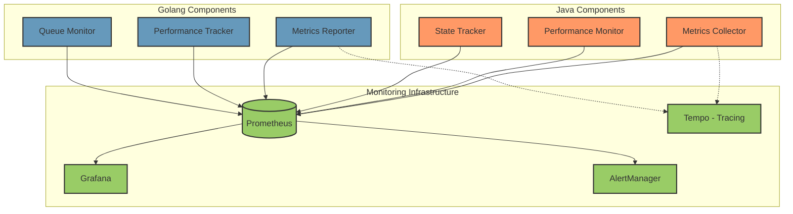

# Workload Orchestration Monitoring Design

## Metrics Collection Architecture



## Key Metrics

### 1. Performance Metrics

```yaml
# High-throughput Job Scheduling
scheduler_latency_ms:
  type: histogram
  buckets: [0.1, 0.5, 1, 2, 5, 10]
  labels:
    - component
    - priority
    
scheduler_throughput:
  type: counter
  labels:
    - success
    - error
    
job_queue_depth:
  type: gauge
  labels:
    - priority
    
scheduler_error_rate:
  type: counter
  labels:
    - error_type
    - severity

# Target Management
target_health_status:
  type: gauge
  labels:
    - target_id
    - state

target_resource_usage:
  type: gauge
  labels:
    - target_id
    - resource_type

# State Management
state_sync_latency_ms:
  type: histogram
  buckets: [1, 5, 10, 25, 50, 100]
  labels:
    - operation_type
    
state_update_rate:
  type: counter
  labels:
    - component
    - operation_type
```

### 2. Business Metrics

```yaml
workload_execution_time:
  type: histogram
  labels:
    - workload_type
    - target_type

workload_success_rate:
  type: counter
  labels:
    - workload_type
    - target_type

resource_utilization:
  type: gauge
  labels:
    - resource_type
    - component
```

## Alerting Rules

### 1. Performance Alerts

```yaml
# Critical Performance
- alert: HighSchedulerLatency
  expr: histogram_quantile(0.99, scheduler_latency_ms) > 1
  for: 1m
  labels:
    severity: critical
  annotations:
    summary: "High scheduler latency detected"

- alert: LowThroughput
  expr: rate(scheduler_throughput{success="true"}[1m]) < 8000
  for: 2m
  labels:
    severity: critical
  annotations:
    summary: "Scheduler throughput below threshold"

# System Health
- alert: HighErrorRate
  expr: rate(scheduler_error_rate[5m]) > 10
  for: 2m
  labels:
    severity: warning
  annotations:
    summary: "Elevated error rate detected"

- alert: QueueBacklog
  expr: job_queue_depth > 5000
  for: 1m
  labels:
    severity: warning
  annotations:
    summary: "Job queue building up"
```

### 2. Resource Alerts

```yaml
- alert: HighCPUUsage
  expr: target_resource_usage{resource_type="cpu"} > 85
  for: 5m
  labels:
    severity: warning
  annotations:
    summary: "High CPU usage detected"

- alert: HighMemoryUsage
  expr: target_resource_usage{resource_type="memory"} > 90
  for: 5m
  labels:
    severity: warning
  annotations:
    summary: "High memory usage detected"
```

## Tracing Configuration

```yaml
sampling:
  probability: 0.1  # Sample 10% of requests
  rules:
    - service: scheduler
      operation: schedule_job
      probability: 1.0  # Always trace scheduling operations
    - service: target_manager
      operation: update_state
      probability: 0.5  # Sample 50% of state updates

spans:
  - name: schedule_job
    attributes:
      - job_id
      - target_id
      - priority
  - name: state_update
    attributes:
      - target_id
      - state_type
      - operation
```

## Dashboards

### 1. Scheduler Performance Dashboard
- Real-time throughput graph
- Latency percentiles (p50, p95, p99)
- Error rate timeline
- Queue depth metrics
- Resource utilization

### 2. Target Management Dashboard
- Target health status
- Resource usage per target
- Workload distribution
- Error rates by target

### 3. System Overview Dashboard
- Component health status
- Cross-component latencies
- Global error rates
- Resource utilization
- Alert status

## Log Aggregation

### Log Levels and Categories

```yaml
log_levels:
  ERROR: Critical failures requiring immediate attention
  WARN: Performance degradation or recoverable errors
  INFO: Normal operation events
  DEBUG: Detailed debugging information

log_categories:
  SCHEDULER: Job scheduling related logs
  TARGET: Target management logs
  STATE: State synchronization logs
  SYSTEM: System-level logs
```

### Retention Policies

```yaml
retention:
  ERROR: 30 days
  WARN: 14 days
  INFO: 7 days
  DEBUG: 2 days

storage:
  hot_storage: 2 days
  warm_storage: 14 days
  cold_storage: 30 days